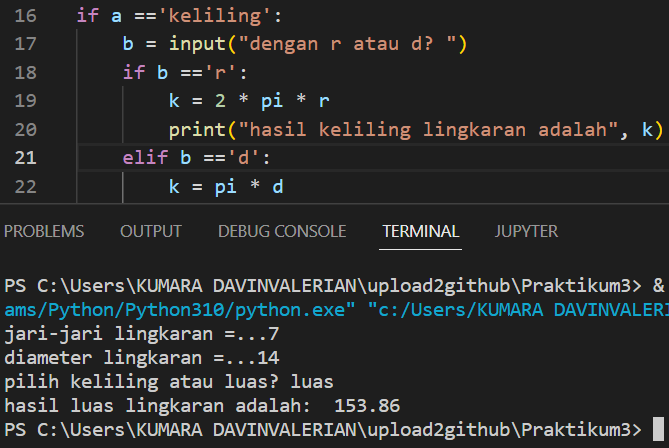

## **Penjelasan Praktikum**

dari script tugas.py
### Modul python
masukkan modul math dengan code
```
from math import pi
```
### Masukkann input
Kemudian membutuhkan inputan yaitu:
1. variabel r = jari-jari lingkaran
2. variabel d = diameter lingkaran
3. variabel a = untuk memilih keliling atau luas
4. variabel b = memilih r atau d ?
dan mengkonversi dari string ke integer dengan `int()` kecuali variabel a. 
Tambahkan variabel 'pi = 3.14'. Pada kasus ini, tanda titik akan berjalan normal 
daripada tanda koma pada bilangan desimal. jika ditambahkan tanda koma pada 
bilangan desimmal akan error. 
### Percabangan
Pada kasus ini, membutuhkan percabangan if-elif-else yang digunakan untuk mengeksekusi 
pernyataan  atau blok pernyataan secara kondisional. Kondisi ini bisa berupa benar 
dan salah atau dapat dipanggil boolean dengan rumus:
```
if ekspresi:
    pernyataan_1
    pernyataan2
```
Dalam kasus ini, Saya akan menggunakan percabangan bertingkat/beranak. 
```
if a =='keliling':
    b = input("dengan r atau d? ")
    if b =='r':
        k = 2 * pi * r
        print("hasil keliling lingkaran adalah", k)
    elif b =='d':
        k = pi * d
        print("hasil keliling lingkaran adalah", k)
elif a =='luas':
    l = pi * r * r
    print("hasil luas lingkaran adalah: ", l)
```
artinya, jika variabel a memilih keliling maka disuruh menginput lagi dengan 
memilih r atau d?
1. jika variabel b memilih r maka akan memasukkan variabel r ke rumus k = 2*pi*r lalu mencetak nilai variabel k
2. jika variabel b memilih d maka akan memasukkan variabel d ke rumus k = pi*d lalu mencetak nilai variabel k
Dan jika variabel a memilih luas maka akan memasukkan variabel  r ke rumus l = pi*r*r lalu mencetak nilai variabel l

Contoh:
Diketahui, nilai variabel r = 7 dan nilai variabel d = 14
Ditanyakan, berapakah 
1. keliling yang  diketahui nilai r?
2. keliling yang  diketahui nilai d?
3. luas lingkaran?
Jawab, 
1. keliling yang  diketahui nilai r?
```
K = 2 * pi * r
K = 2 * 3,14 * 7
K = 43.96 
```


2. keliling yang  diketahui nilai d?
```
K = pi * d
K = 3,14 * 14
K = 43.96
```


3. luas lingkaran
```
L = pi * r * r
L = 3,14 * 7 * 7
L = 153.86
```

